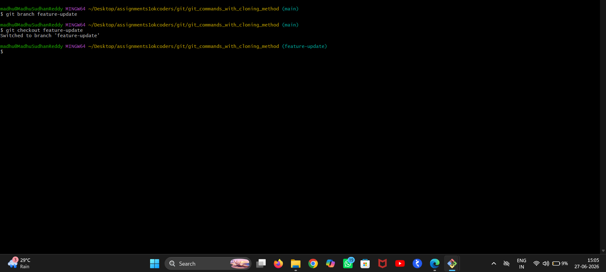
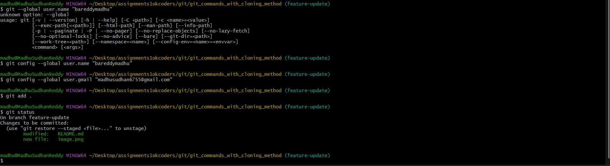

# git_commands_with_cloning_method

madhu@MadhuSudhanReddy MINGW64 ~/Desktop/assignments1okcoders/git/git_commands_with_cloning_method (main)
$ git bash feature-update
git: 'bash' is not a git command. See 'git --help'.

The most similar command is
        stash

madhu@MadhuSudhanReddy MINGW64 ~/Desktop/assignments1okcoders/git/git_commands_with_cloning_method (main)
$ git branch feature-update

madhu@MadhuSudhanReddy MINGW64 ~/Desktop/assignments1okcoders/git/git_commands_with_cloning_method (main)
$ git checkout feature-update
Switched to branch 'feature-update'

madhu@MadhuSudhanReddy MINGW64 ~/Desktop/assignments1okcoders/git/git_commands_with_cloning_method (feature-update)
$ git status
On branch feature-update
nothing to commit, working tree clean

madhu@MadhuSudhanReddy MINGW64 ~/Desktop/assignments1okcoders/git/git_commands_with_cloning_method (feature-update)
$ git status
On branch feature-update
Changes not staged for commit:
  (use "git add <file>..." to update what will be committed)
  (use "git restore <file>..." to discard changes in working directory)
        modified:   README.md

Untracked files:
  (use "git add <file>..." to include in what will be committed)
        image.png

no changes added to commit (use "git add" and/or "git commit -a")

madhu@MadhuSudhanReddy MINGW64 ~/Desktop/assignments1okcoders/git/git_commands_with_cloning_method (feature-update)
$ git --global user.name "bareddymadhu"
unknown option: --global
usage: git [-v | --version] [-h | --help] [-C <path>] [-c <name>=<value>]
           [--exec-path[=<path>]] [--html-path] [--man-path] [--info-path]
           [-p | --paginate | -P | --no-pager] [--no-replace-objects] [--no-lazy-fetch]
           [--no-optional-locks] [--no-advice] [--bare] [--git-dir=<path>]
           [--work-tree=<path>] [--namespace=<name>] [--config-env=<name>=<envvar>]
           <command> [<args>]

madhu@MadhuSudhanReddy MINGW64 ~/Desktop/assignments1okcoders/git/git_commands_with_cloning_method (feature-update)
$ git config --global user.name "bareddymadhu"

madhu@MadhuSudhanReddy MINGW64 ~/Desktop/assignments1okcoders/git/git_commands_with_cloning_method (feature-update)
$ git config --global user.gmail "madhusudhan6755@gmail.com"

madhu@MadhuSudhanReddy MINGW64 ~/Desktop/assignments1okcoders/git/git_commands_with_cloning_method (feature-update)
$ git add .

madhu@MadhuSudhanReddy MINGW64 ~/Desktop/assignments1okcoders/git/git_commands_with_cloning_method (feature-update)
$ git status
On branch feature-update
Changes to be committed:
  (use "git restore --staged <file>..." to unstage)
        modified:   README.md
        new file:   image.png

madhu@MadhuSudhanReddy MINGW64 ~/Desktop/assignments1okcoders/git/git_commands_with_cloning_method (feature-update)
$ git add .

madhu@MadhuSudhanReddy MINGW64 ~/Desktop/assignments1okcoders/git/git_commands_with_cloning_method (feature-update)
$ git commit -m "update"
[feature-update 3ae9660] update
 3 files changed, 6 insertions(+), 1 deletion(-)
 create mode 100644 image-1.png
 create mode 100644 image.png

madhu@MadhuSudhanReddy MINGW64 ~/Desktop/assignments1okcoders/git/git_commands_with_cloning_method (feature-update)
$ git checkout main
Switched to branch 'main'
Your branch is up to date with 'origin/main'.

madhu@MadhuSudhanReddy MINGW64 ~/Desktop/assignments1okcoders/git/git_commands_with_cloning_method (main)
$ git merge feature-update
Updating cb3a7fe..3ae9660
Fast-forward
 README.md   |   7 ++++++-
 image-1.png | Bin 0 -> 70790 bytes
 image.png   | Bin 0 -> 70556 bytes
 3 files changed, 6 insertions(+), 1 deletion(-)
 create mode 100644 image-1.png
 create mode 100644 image.png

madhu@MadhuSudhanReddy MINGW64 ~/Desktop/assignments1okcoders/git/git_commands_with_cloning_method (main)
$ git log
commit 3ae9660704694fc095bda478c59dc743cfc354a6 (HEAD -> main, feature-update)
Author: bareddymadhu <madhusudhan6755@gmail.com>
Date:   Sat Jun 27 15:11:00 2026 +0530

    update

commit cb3a7fe83aeae8c8d58477f5fc4935b7dfa26fdb (origin/main, origin/HEAD)
Author: bareddymadhu <madhusudhan6755@gmail.com>
Date:   Fri Jun 26 22:23:14 2026 +0530

    Added new paragraph to index.html

commit 5c1ca39a678a1db4ee8397cc98d2f8e0be816614
Author: BAREDDY MADHU SUDHAN REDDY <142133554+bareddymadhu@users.noreply.github.com>
Date:   Fri Jun 26 21:54:10 2026 +0530

    Create index.html

commit e26cf726835860170703cebf6bf089115964173f
Author: BAREDDY MADHU SUDHAN REDDY <142133554+bareddymadhu@users.noreply.github.com>
Date:   Fri Jun 26 21:52:38 2026 +0530

    Initial commit

madhu@MadhuSudhanReddy MINGW64 ~/Desktop/assignments1okcoders/git/git_commands_with_cloning_method (main)
$ git push
Enumerating objects: 7, done.
Counting objects: 100% (7/7), done.
Delta compression using up to 12 threads
Compressing objects: 100% (5/5), done.
Writing objects: 100% (5/5), 117.13 KiB | 19.52 MiB/s, done.
Total 5 (delta 0), reused 0 (delta 0), pack-reused 0 (from 0)
To https://github.com/bareddymadhu/git_commands_with_cloning_method.git
   cb3a7fe..3ae9660  main -> main

madhu@MadhuSudhanReddy MINGW64 ~/Desktop/assignments1okcoders/git/git_commands_with_cloning_method (main)
$

# Create a new branch using the git branch command and switch to it using the git checkout command.

# Use the git add command to stage the changes and commit them using the git commit command with a meaningful commit message.

